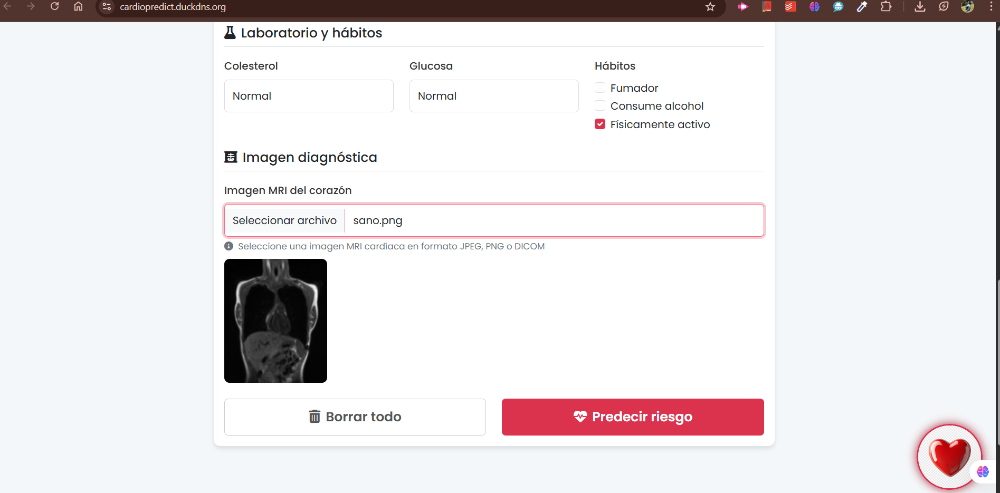
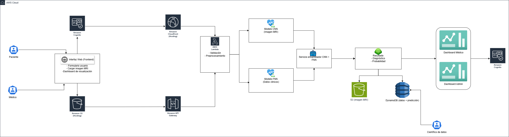
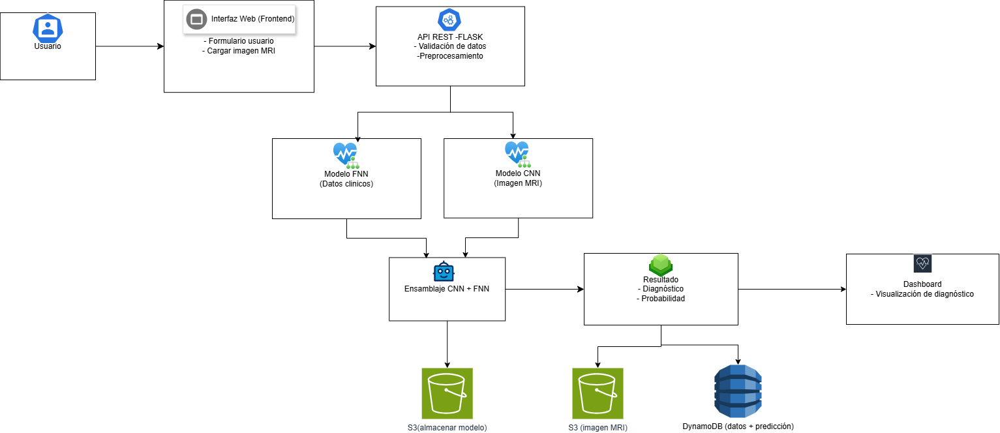
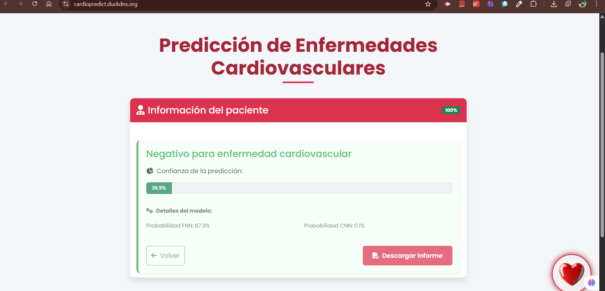

# Predicción de Enfermedades Cardiovasculares

#### 👩🏼‍💻👨🏻‍💻 AUTORES: [Saray Alieth Mendivelso Gonzalez](https://github.com/saraygonm) / [Juan Pablo Daza Pereira](https://github.com/JuanPabl07DP) / [Nicolas Bernal Fuquene](https://github.com/saraygonm)


- Este proyecto es un sistema basado en inteligencia artificial que permite predecir el riesgo de enfermedades cardiovasculares a partir de datos clínicos y una imagen de resonancia magnética (MRI) del paciente. Utiliza redes neuronales como FNN (Feedforward Neural Network) para los datos clínicos y CNN (Convolutional Neural Network) para la imagen médica.


## 📍 Comenzando
Estas instrucciones te permitirán obtener una copia del proyecto en funcionamiento en tu máquina local para propósitos de desarrollo y pruebas.

-----

### 🔧 Prerrequisitos

Para ejecutar el proyecto necesitas instalar:

- [Git](https://git-scm.com/)
- Un navegador web.
- Entorno de desarrollo integrado (IDE) de tu preferencia, como:
    - Visual Studio Code
    - Sublime Text
    - Notepad++
----

### ⚙️ Instalación

**1. Clona el repositorio:**
   ```sh
   git clone https://github.com/JuanPabl07DP/CardioPredict.git
````

**2. Crea un entorno virtual:**

```sh
python -m venv venv
```

**3. Activa el entorno virtual:**

* En Windows:

  ```sh
  venv\Scripts\activate
  ```
* En MacOS/Linux:

  ```sh
  source venv/bin/activate
  ```

**4. Instala las dependencias necesarias:**

```sh
pip install -r requirements.txt
```

**5. Accede a la aplicación, buscando en tu navegador:**

```sh
http://localhost:5080
```

Una vez iniciado el servidor, podrás visualizar la página web en tu navegador.


<p align="center">

</p>

<p align="center">

</p>
---------------------

### ✅ Ejecutar las pruebas


-----------
### 🏗️ Arquitectura
#### Arquitectura Empresarial

El sistema permite a los usuarios ingresar datos clínicos y una imagen MRI a través de una interfaz web. Estos datos son procesados por una API REST y enviados a modelos de inteligencia artificial (FNN para datos clínicos y CNN para la imagen). Los resultados se combinan y se almacenan en DynamoDB, mientras que la imagen se guarda en Amazon S3. Los resultados se visualizan en un dashboard interactivo para su análisis médico.
<p align="center">

</p>


#### Arquitectura Prototipo

Los profesionales de la salud ingresan los datos clínicos y la imagen MRI en una interfaz web. La API REST procesa los datos y los envía a los modelos de IA (FNN y CNN). Los resultados se combinan, se almacenan en DynamoDB y se visualizan en un dashboard en tiempo real, proporcionando un diagnóstico automatizado con la probabilidad de riesgo cardiovascular.
<p align="center">

</p>

#### Servidor Java

- Clase principal: Server

- Puerto: 5000


-------------------- 
#### Servidor Python

* Clase principal: `Server`
* Puerto: 5000

### 🌐 Frontend

El frontend está diseñado con tecnologías estándar de HTML, CSS y JavaScript. Presenta una interfaz web sencilla y fácil de usar donde los usuarios ingresan los datos clínicos, cargan imágenes de resonancia magnética y como resultado obtienen un informe detallado del paciente en formato PDF.

1) Formulario donde se ingresaran los datos del paciente
<p align="center">

</p>

2) Seleccionar la imagen de resonancia magnética (MRI) de tu equipo
<p align="center">

</p>

3) Analisis implementado con la IA
<p align="center">

</p>

4) Resultado e Informe detallado del paciente en formato PDF
<p align="center">

</p>

-------
### 🚀 Despliegue


--------------
### 🛠️ Construido con

* **Backend**: Flask, Python
* **Frontend**: HTML, CSS, JavaScript
* **Modelos de IA**: FNN, CNN (utilizando TensorFlow)
* **Base de datos**: DynamoDB (para almacenamiento de resultados)
* **Almacenamiento de imágenes**: Amazon S3


-------------

### 🌍 Arquitectura del Prototipo

Flujo:

1. **Usuario**: Ingresa los datos clínicos y carga la imagen MRI.
2. **Frontend Web**: Presenta el formulario y envía los datos a la API.
3. **API REST (Flask)**: Procesa y valida los datos antes de enviarlos a los modelos de IA.
4. **Modelos de IA**: FNN analiza los datos clínicos, y CNN procesa la imagen MRI.
5. **Resultado**: Se genera un diagnóstico y se almacena en DynamoDB, la imagen se guarda en Amazon S3.
6. **Dashboard**: Muestra los resultados en tiempo real a través de un informe en PDF.

### 📊 Ejemplo de uso

1. Un profesional de la salud accede a la interfaz web y completa el formulario con los datos clínicos del paciente.
2. La aplicación envía los datos a través de la API REST, donde se validan y se procesan.
3. Los resultados se visualizan en informe en formato PDF, ayudando al diagnóstico médico.

----------------------
### 🧑‍⚕️ Casos de uso

* Hospitales que requieren un sistema ágil para diagnóstico temprano.
* Clínicas con poco personal que utilizan IA para predicciones rápidas.
* Plataformas de telemedicina y salud remota.

-------------------------

### 📝 Resultados y Evaluación

#### Modelo FNN

* Precisión: 73.2%
* AUC: 0.80

#### Modelo CNN

* Precisión: 95%
* AUC: 0.99

Ambos modelos han mostrado un rendimiento sobresaliente, destacando la precisión en la identificación de casos de enfermedad cardiovascular.

---

### 📺 Video de Demostración

[](https://youtu.be/IRIfBho3BCM)


En este video se muestra el funcionamiento de la página, comparando los casos de un paciente sano y uno enfermo.En este video se muestra el funcionamiento de la página, comparando los casos de un paciente sano y uno enfermo.


-------------
¡Ayuda a salvar vidas a través de la inteligencia artificial! 🌟

