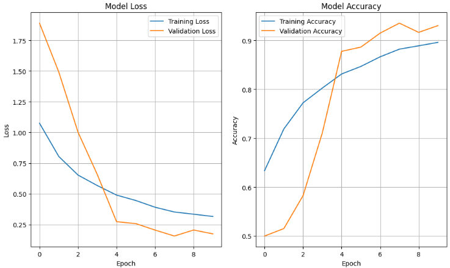
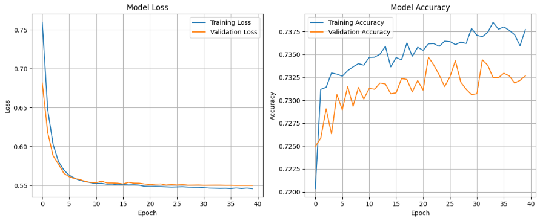
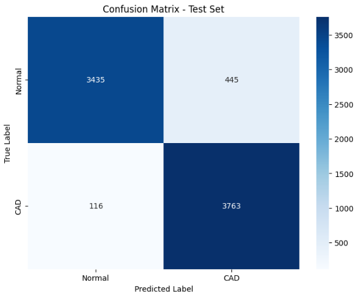
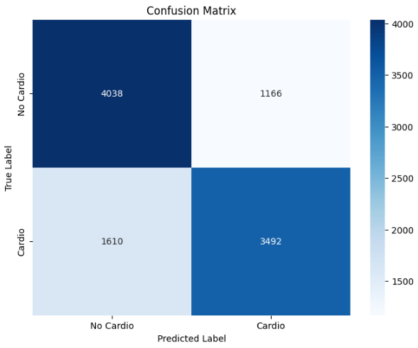
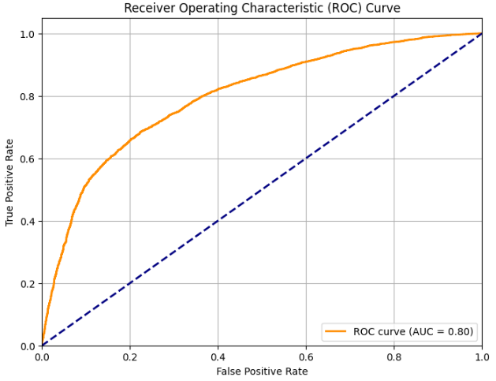

# Predicción de Enfermedades Cardiovasculares

#### 👩🏼‍💻👨🏻‍💻 AUTORES: [Saray Alieth Mendivelso Gonzalez](https://github.com/saraygonm) / [Juan Pablo Daza Pereira](https://github.com/JuanPabl07DP) / [Nicolas Bernal Fuquene](https://github.com/NicoBernal19)


- Este proyecto es un sistema basado en inteligencia artificial que permite predecir el riesgo de enfermedades cardiovasculares a partir de datos clínicos y una imagen de resonancia magnética (MRI) del paciente. Utiliza redes neuronales como FNN (Feedforward Neural Network) para los datos clínicos y CNN (Convolutional Neural Network) para la imagen médica. En este repositorio se encuentra ademas, el paper realizado con todo el trabajo de investigacion, mas detalles de la evaluacion y resultados obtenidos.


## 📍 Comenzando
Estas instrucciones te permitirán obtener una copia del proyecto en funcionamiento en tu máquina local para propósitos de desarrollo y pruebas.

-----

### 🔧 Prerrequisitos

Para ejecutar el proyecto necesitas instalar:

- [Git](https://git-scm.com/)
- Un navegador web.
- Entorno de desarrollo integrado (IDE) de tu preferencia, como:
    - Visual Studio Code
    - IntelliJ
    - Eclipse
----

### ⚙️ Instalación

**1. Clona el repositorio:**
   ```sh
   git clone https://github.com/JuanPabl07DP/CardioPredict.git
````

**2. Crea un entorno virtual:**

```sh
python -m venv venv
```

**3. Activa el entorno virtual:**

* En Windows:

  ```sh
  venv\Scripts\activate
  ```
* En MacOS/Linux:

  ```sh
  source venv/bin/activate
  ```

**4. Instala las dependencias necesarias:**

```sh
pip install -r requirements.txt
```

**5. Accede a la aplicación, buscando en tu navegador:**

```sh
http://localhost:5000
```

Una vez iniciado el servidor, podrás visualizar la página web en tu navegador.


<p align="center">

</p>

<p align="center">

</p>

---------------------

### ✅ Pruebas

Las pruebas se enfocan en la evaluación de los modelos, y las gráficas presentadas corresponden a los resultados obtenidos durante el proceso de validación. Estas incluyen métricas clave como la precisión, la curva ROC, y la matriz de confusión, que nos permiten evaluar el desempeño de los modelos de IA utilizados para la predicción de enfermedades cardiovasculares.


1. **Gráficas de Pérdida y Precisión del Modelo (1er conjunto de imágenes)**:
  - La gráfica de **pérdida** muestra cómo disminuye el error a lo largo de las épocas de entrenamiento, con una notable reducción en las primeras épocas.
  - La gráfica de **precisión** refleja cómo mejora la exactitud del modelo a medida que avanza el entrenamiento. Una mayor precisión indica un modelo más eficiente.
<p align="center">

</p>


2. **Gráficas de Pérdida y Precisión del Modelo (2do conjunto de imágenes)**:
  - En estas gráficas se observa una convergencia más lenta en la pérdida y precisión. Esto sugiere que el modelo está aprendiendo de manera más gradual, con mejoras más sutiles en la precisión durante más épocas.

<p align="center">

</p>

3. **Matriz de Confusión (1er conjunto de imágenes)**:
  - Esta gráfica muestra la relación entre las etiquetas predichas y las verdaderas para un conjunto de prueba. Permite ver cuántos casos fueron correctamente clasificados como "Normal" o "CAD", así como los falsos positivos y negativos.

<p align="center">

</p>

4. **Matriz de Confusión (2do conjunto de imágenes)**:
  - Similar a la primera, pero con una mayor cantidad de datos, muestra la efectividad del modelo para predecir correctamente los casos de "Cardio" y "No Cardio".

<p align="center">

</p>

5. **Curva ROC (Última imagen)**:
  - La curva ROC muestra la relación entre la tasa de verdaderos positivos y la tasa de falsos positivos. Un **AUC (Área Bajo la Curva)** de 0.80 indica que el modelo tiene una buena capacidad para discriminar entre las clases de "Cardio" y "No Cardio".


<p align="center">

</p>

-----------
### 🏗️ Arquitectura
#### Arquitectura Empresarial

El sistema permite a los usuarios ingresar datos clínicos y una imagen MRI a través de una interfaz web. Estos datos son procesados por una API REST y enviados a modelos de inteligencia artificial (FNN para datos clínicos y CNN para la imagen). Los resultados se combinan y se almacenan en DynamoDB, mientras que la imagen se guarda en Amazon S3. Los resultados se visualizan en un dashboard interactivo para su análisis médico.
<p align="center">

</p>


#### Arquitectura Prototipo

Los profesionales de la salud ingresan los datos clínicos y la imagen MRI en una interfaz web. La API REST procesa los datos y los envía a los modelos de IA (FNN y CNN). Los resultados se combinan, se almacenan en DynamoDB y se visualizan en un dashboard en tiempo real, proporcionando un diagnóstico automatizado con la probabilidad de riesgo cardiovascular.
<p align="center">

</p>


-------------------- 
#### Servidor Python

* Clase principal: `Server`
* Puerto: 5000

------------------

### 🌐 Frontend

El frontend está diseñado con tecnologías estándar de HTML, CSS y JavaScript. Presenta una interfaz web sencilla y fácil de usar donde los usuarios ingresan los datos clínicos, cargan imágenes de resonancia magnética y como resultado obtienen un informe detallado del paciente en formato PDF.

1) Formulario donde se ingresaran los datos del paciente
<p align="center">

</p>

2) Seleccionar la imagen de resonancia magnética (MRI) de tu equipo
<p align="center">

</p>

3) Analisis implementado con la IA
<p align="center">

</p>

4) Resultado e Informe detallado del paciente en formato PDF
<p align="center">

</p>

--------------
### 🛠️ Construido con

* **Backend**: Flask, Python
* **Frontend**: HTML, CSS, JavaScript
* **Modelos de IA**: FNN, CNN (utilizando TensorFlow)
* **Base de datos**: DynamoDB (para almacenamiento de resultados)
* **Almacenamiento de imágenes**: Amazon S3


-------------

### 🌍 Arquitectura del Prototipo

Flujo:

1. **Usuario**: Ingresa los datos clínicos y carga la imagen MRI.
2. **Frontend Web**: Presenta el formulario y envía los datos a la API.
3. **API REST (Flask)**: Procesa y valida los datos antes de enviarlos a los modelos de IA.
4. **Modelos de IA**: FNN analiza los datos clínicos, y CNN procesa la imagen MRI.
5. **Resultado**: Se genera un diagnóstico y se almacena en DynamoDB, la imagen se guarda en Amazon S3.
6. **Dashboard**: Muestra los resultados en tiempo real a través de un informe en PDF.

### 📊 Ejemplo de uso

1. Un profesional de la salud accede a la interfaz web y completa el formulario con los datos clínicos del paciente.
2. La aplicación envía los datos a través de la API REST, donde se validan y se procesan.
3. Los resultados se visualizan en informe en formato PDF, ayudando al diagnóstico médico.

----------------------
### 🧑‍⚕️ Casos de uso

* Hospitales que requieren un sistema ágil para diagnóstico temprano.
* Clínicas con poco personal que utilizan IA para predicciones rápidas.
* Plataformas de telemedicina y salud remota.

-------------------------

### 📝 Resultados y Evaluación

#### Modelo FNN

* Precisión: 73.2%
* AUC: 0.80

#### Modelo CNN

* Precisión: 95%
* AUC: 0.99

Ambos modelos han mostrado un rendimiento sobresaliente, destacando la precisión en la identificación de casos de enfermedad cardiovascular.


------
### 📥 Descarga de Modelos

Puedes descargar los modelos desde el siguiente enlace de Google Drive:

[Descargar Modelos](https://drive.google.com/drive/folders/1hmYHX5sSbYs6_hfc9V_SpqzNMfMvKRnK?usp=drive_link)

----------
### 📥 Repositorios de Modelos

Los repositorios de los entrenamientos de los modelos están disponibles en los siguientes enlaces:

- [Repositorio FNN](https://github.com/JuanPabl07DP/Cardiovascular_FNN.git)
- [Repositorio CNN](https://github.com/JuanPabl07DP/Cardiovascular_CNN.git)

### 📺 Video de Demostración

[](https://youtu.be/IRIfBho3BCM)


En este video se muestra el funcionamiento de la página, comparando los casos de un paciente sano y uno enfermo, y en donde podemos evidenciar la eficiencia y precision de nuestra aplicacion. Por supuesto, para que ellos que prefieran probar la aplicacion por si mismos, pueden dirigirse al siguiente link, en donde esta alojada la version actual de la app: 
[Aplicacion Link](https://cardiopredict.duckdns.org/)


-------------
¡Ayuda a salvar vidas a través de la inteligencia artificial! 🌟

